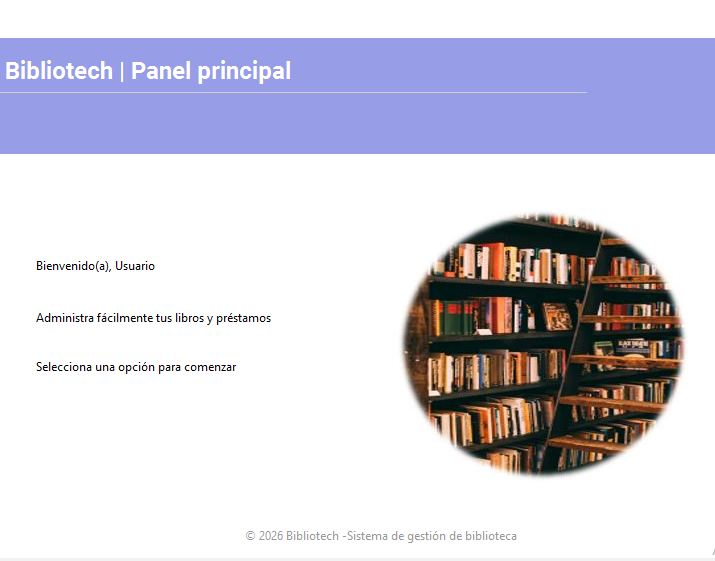
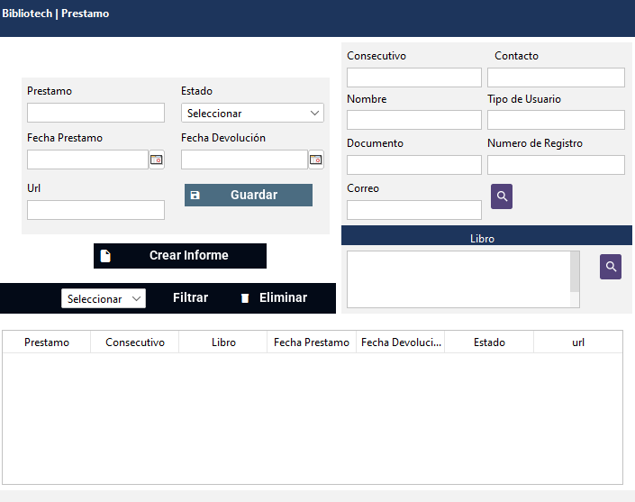

# BiblioTech – Sistema de Gestión de Biblioteca

BiblioTech es una aplicación de escritorio desarrollada en Java Swing, diseñada para la gestión integral de bibliotecas pequeñas y medianas.

El sistema permite administrar lectores, libros, categorías y préstamos, garantizando integridad de datos, control de acceso por roles y seguridad básica en el manejo de credenciales. La aplicación funciona completamente en entorno local y puede instalarse en Windows mediante un ejecutable generado con Inno Setup.

---

## Objetivo del Proyecto

Desarrollar una solución funcional bajo una arquitectura estructurada (MVC + DAO), aplicando buenas prácticas de persistencia, validación, seguridad y organización del código.

El proyecto simula un entorno real de gestión bibliotecaria, enfocado en mantenibilidad y separación de responsabilidades.

---

## Vista del sistema

### Login

  

### Panel principal

  

### Gestión de préstamos

  

---

## Funcionalidades

- Sistema de autenticación con control de roles:
- Usuario General
- Usuario Administrador

- Gestión completa de libros, lectores y categorías (operaciones CRUD).

- Gestión de préstamos implementando una relación muchos-a-muchos entre préstamos y libros, normalizada mediante tabla intermedia para mantener la integridad referencial.

- Búsqueda dinámica mediante filtros adaptativos.

- Generación de informes en formato Word utilizando plantillas dinámicas.

- Validaciones independientes en la capa de presentación.

- Encriptación de contraseñas mediante BCrypt.

- Cifrado de credenciales sensibles utilizando AES.

- Instalador para Windows generado con Inno Setup.
---

## Arquitectura

El proyecto está estructurado bajo el patrón MVC (Modelo – Vista – Controlador) complementado con una capa DAO para la persistencia de datos, permitiendo una separación clara de responsabilidades y mayor mantenibilidad del código.

---

## Tecnologías

| | | |
| :---: | :---: | :---: |
|  |  |  | |

---

## Instalación y Configuración

1. Clonar el repositorio.
2. Configurar la base de datos MySQL.
3. En la carpeta `resources/`:
   - Renombrar `config.properties.example` a `config.properties` y configurar la conexión.
   - Renombrar `dsr.properties.example` y definir la llave AES (16 caracteres).
4. Agregar las librerías ubicadas en la carpeta `/lib`.
5. Ejecutar la clase principal.

---

Proyecto personal orientado a demostrar habilidades en desarrollo de aplicaciones de escritorio con Java, arquitectura por capas y gestión de bases de datos relacionales.

---

## Demo en video

Demostración completa del funcionamiento del sistema disponible en el siguiente enlace:

[Ver demostración del sistema](https://youtu.be/t1rlWAyUbrg)
